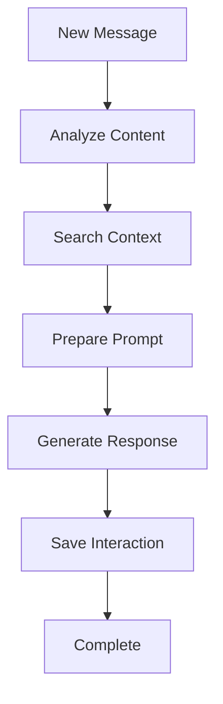

# AI Code Assistant: Context-Aware Development Tool

## Overview

We've built a sophisticated AI-powered coding assistant that integrates with Continue.dev to provide context-aware responses for development tasks. The system learns from your coding conversations and becomes smarter over time, making it perfect for training custom Small Language Models (SLMs) for specific projects.

---

## 1. What Are AI Agents?

**AI Agents** are autonomous programs that can:
- **Perceive** their environment (your code, conversations, context)
- **Reason** about problems using available information
- **Act** by providing relevant solutions based on past experiences
- **Learn** from interactions to improve future responses

### Our Agent's Capabilities:
- 🧠 **Context Understanding**: Analyzes your current coding session
- 🔍 **Smart Retrieval**: Finds relevant past solutions from your project history
- 🎯 **Task Detection**: Automatically identifies if you're debugging, implementing, or explaining code
- 📚 **Knowledge Building**: Stores conversations for future reference and SLM training

---

## 2. Multi-Model Architecture

### Available Models:

#### **Local Models (Fast & Private)**
- **Gemma 3 4B**: Lightning-fast responses for quick questions
- **Nomic Embed Text**: Converts text to vectors for similarity search

#### **Cloud Models (High Quality)**
- **GPT-4**: Advanced reasoning for complex coding tasks
- **Claude 3 Sonnet**: Excellent for code review and explanation

#### **Smart Routing System**
```yaml
# Automatic model selection based on:
X-Use-Case: "quick_answers" → Gemma (Local)
X-Priority: "quality" → GPT-4/Claude (Cloud)
X-Task-Type: "debug" → Fast local model
X-Task-Type: "implement" → High-quality cloud model
```

### Why Multiple Models?
- **Cost Efficiency**: Use free local models for simple queries
- **Performance**: Route complex tasks to powerful cloud models
- **Privacy**: Keep sensitive code discussions local when needed

---

## 3. Context Fetching: The Smart Memory System

### How We Find Relevant Context:

#### **Vector Similarity Search**
```python
# 1. Convert your question to a vector
question_vector = embed("How do I fix this authentication error?")

# 2. Search similar past conversations
similar_contexts = vector_db.search(
    vector=question_vector,
    project="ai_code_assistant",
    limit=3
)
```

#### **What Gets Stored:**
- 🗣️ **Question-Answer Pairs**: Complete Q&A conversations
- 🐛 **Error Patterns**: Debugging sessions and solutions
- 📝 **Code Snippets**: Implementation examples
- 📚 **Library Usage**: Import patterns and framework usage

#### **Context Enhancement Pipeline:**
1. **Analyze** your current message for code, errors, libraries
2. **Search** for similar past conversations in your project
3. **Retrieve** recent messages from your current session
4. **Inject** relevant context into the AI prompt
5. **Generate** response with full project knowledge

### Example Context Injection:
```
You are an expert Python developer with access to previous conversations.

Project: ai_code_assistant
Session: debug_fastapi_auth_2024_06_10

### Similar Previous Conversations:
**Example 1** (relevance: 0.89):
Q: FastAPI authentication middleware not working
A: You need to add the middleware to the app instance...

### Recent Conversation History:
User: I'm getting 401 errors on protected routes
Assistant: Let's check your JWT token validation...

Instructions:
- Reference previous solutions when relevant
- Consider error patterns and debugging context
```

---

## 4. Session-Based Chat History

### Session Management:

#### **Session Structure:**
```
Project: ai_code_assistant
├── Session: debug_session_001
│   ├── Message 1: "Auth middleware issue"
│   ├── Message 2: "Try adding dependency injection"
│   └── Message 3: "Perfect! That worked"
├── Session: feature_user_management
│   ├── Message 1: "How to add user roles?"
│   └── Message 2: "Here's a role-based system..."
```

#### **How Sessions Work:**
1. **Manual Session Control**: You set `X-Session-ID` in Continue.dev config
2. **Conversation Isolation**: Each session maintains its own context
3. **Recent History**: AI remembers recent messages within the same session
4. **Cross-Session Learning**: Can find similar solutions from other sessions

#### **Session Benefits:**
- 🎯 **Focused Context**: Only relevant conversation history
- 🧵 **Thread Continuity**: AI remembers what you discussed earlier
- 📊 **Progress Tracking**: See how conversations evolve
- 🎓 **Learning Isolation**: Different topics don't interfere

### Retrieving Session History:
```bash
# Get all messages from a specific session
GET /sessions/ai_code_assistant/dev_user_001/debug_session_001

# Returns chronological conversation flow
{
  "messages": [
    {"role": "user", "content": "FastAPI auth error..."},
    {"role": "assistant", "content": "Let's check your middleware..."},
    {"role": "user", "content": "Still getting 401s..."},
    {"role": "assistant", "content": "Try this JWT validation..."}
  ]
}
```

---

## 5. Project-Based Organization

### Project Structure:

#### **Multi-Project Support:**
```
Database Structure:
├── Project: ai_code_assistant (FastAPI development)
├── Project: data_pipeline (Data science work)  
├── Project: frontend_app (React development)
└── Project: mobile_app (Flutter development)
```

#### **Project Isolation Benefits:**
- 🏗️ **Technology Separation**: Python solutions don't mix with React solutions
- 👥 **Team Collaboration**: Multiple developers can work on same project
- 📈 **Specialized Learning**: AI becomes expert in each project's patterns
- 🎯 **Focused Context**: Only relevant project knowledge is retrieved

#### **Project-Specific Features:**
```python
# Context search is project-scoped
similar_contexts = search_similar(
    query="authentication error",
    project_name="ai_code_assistant",  # Only searches this project
    limit=3
)

# Statistics are project-specific
GET /projects/ai_code_assistant/code-stats
{
  "total_messages": 156,
  "error_discussions": 23,
  "messages_with_code": 89,
  "top_languages": ["python", "sql"],
  "top_libraries": ["fastapi", "pydantic", "sqlalchemy"]
}
```

#### **Why Project-Based?**
- **Cleaner Context**: No JavaScript solutions when asking about Python
- **Better Training Data**: More focused datasets for SLM training
- **Team Scaling**: Multiple teams can use the same system
- **Knowledge Specialization**: AI becomes domain expert per project

---

## 6. Training Small Language Models (SLMs) for Maintenance

### The Vision: Custom Maintenance Bots

#### **Why Train SLMs?**
- 🎯 **Project-Specific Expertise**: Knows your exact codebase patterns
- ⚡ **Fast Local Inference**: No API calls, instant responses
- 💰 **Cost Effective**: No per-token charges for routine questions
- 🔒 **Privacy**: Keep proprietary code knowledge internal
- 🤖 **Automated Maintenance**: Handle routine tasks autonomously

### **Training Data Collection:**

#### **Rich Metadata for Each Conversation:**
```json
{
  "question": "How do I add rate limiting to FastAPI?",
  "answer": "You can use slowapi library...",
  "metadata": {
    "language": "python",
    "task_type": "implement",
    "libraries": ["fastapi", "slowapi"],
    "complexity_score": 25,
    "is_error_related": false,
    "file_paths": ["src/api.py"],
    "tags": ["helpful", "correct_code"]
  }
}
```

#### **Quality Curation System:**
```python
# Star high-quality responses
POST /star/message_id_123

# Tag conversations by type
POST /tag/message_id_456?tag=debugging_session
POST /tag/message_id_789?tag=best_practice

# Export curated training data
GET /projects/ai_code_assistant/starred
```

### **Training Pipeline:**

#### **Phase 1: Data Preparation**
1. **Export Conversations**: Get all starred/tagged conversations
2. **Format for Training**: Convert to instruction-following format
3. **Quality Filter**: Remove low-quality or incorrect responses
4. **Augment with Context**: Include project-specific patterns

#### **Phase 2: SLM Training**
```python
# Example training format
{
  "instruction": "Add authentication middleware to FastAPI",
  "input": "Project: ai_code_assistant, Language: Python, Libraries: fastapi, pydantic",
  "output": "Here's how to add JWT authentication middleware...",
  "metadata": {
    "project": "ai_code_assistant",
    "complexity": "medium",
    "task_type": "implement"
  }
}
```

#### **Phase 3: Deployment**
- **Local Inference**: Run trained SLM on your infrastructure
- **Integration**: Replace cloud models with custom SLM for routine tasks
- **Continuous Learning**: Keep collecting data to retrain periodically

### **Maintenance Use Cases:**
- 🔧 **Code Reviews**: "Is this implementation following our patterns?"
- 🐛 **Bug Diagnosis**: "What usually causes this type of error?"
- 📖 **Documentation**: "Explain how our authentication system works"
- ⚡ **Quick Fixes**: "Generate boilerplate for new API endpoint"
- 🎯 **Best Practices**: "What's the standard way we handle database connections?"

---

## 7. LangGraph: The Orchestration Pipeline

### Why LangGraph?

**LangGraph** provides a **visual, declarative way** to build AI workflows that are:
- 🔄 **Stateful**: Maintains conversation context throughout processing
- 🏗️ **Modular**: Easy to add/remove processing steps
- 🔍 **Debuggable**: Clear flow visualization and step-by-step execution
- ⚡ **Scalable**: Async processing with proper error handling

### **Our Processing Pipeline:**



#### **Step-by-Step Breakdown:**

### **1. Analyze Content**
```python
async def analyze_content(state):
    """Extract coding-specific metadata from user message"""
    # Detect programming language
    # Identify task type (debug/implement/explain)
    # Extract code blocks and imports
    # Calculate complexity score
    # Flag error-related discussions
    return enhanced_state
```

**What it does:**
- 🔍 Scans message for code blocks, file paths, error patterns
- 🏷️ Auto-detects task type (overridable by headers)
- 📊 Calculates complexity score for prioritization
- 🐛 Identifies debugging vs implementation requests

### **2. Search Context**
```python
async def search_context(state):
    """Find relevant past conversations and recent history"""
    # Vector search for similar conversations
    # Get recent session messages
    # Filter by project scope
    return context_enhanced_state
```

**What it does:**
- 🎯 Finds 3 most similar past Q&A pairs from project
- 📝 Retrieves recent messages from current session
- 🔒 Maintains project-based knowledge isolation

### **3. Prepare Prompt**
```python
async def prepare_prompt(state):
    """Inject context into AI prompt with coding focus"""
    # Build context-aware system prompt
    # Include similar conversations
    # Add recent session history
    # Specify programming language and task type
    return prompt_ready_state
```

**What it does:**
- 🎭 Creates role-specific prompts (Python expert, debugger, etc.)
- 📚 Injects relevant historical context
- 🎯 Focuses on detected programming language and task
- 💡 Provides error patterns and debugging context

### **4. Generate Response**
```python
async def generate_response(state):
    """Placeholder - actual generation happens in FastAPI"""
    # This step is handled by the main API
    # Supports streaming responses
    # Works with multiple AI models
    return state
```

**Why separate?**
- 🌊 **Streaming Support**: Real-time response delivery
- 🔄 **Model Flexibility**: Easy switching between AI providers
- ⚡ **Performance**: Optimized for different model types

### **5. Save Interaction**
```python
async def save_interaction(state):
    """Store Q&A with rich metadata for training"""
    # Save user message with analysis metadata
    # Store assistant response with context info
    # Link question-answer pairs
    # Prepare data for future SLM training
    return final_state
```

**What it stores:**
- 💾 Complete conversation with metadata
- 🔗 Parent-child message relationships
- 📊 Code analysis results and complexity scores
- 🏷️ Training-ready tags and quality indicators

### **Benefits of This Pipeline:**

#### **For Development:**
- 🧩 **Modular**: Easy to add new analysis steps
- 🔧 **Debuggable**: Clear visibility into each processing stage
- 🎯 **Testable**: Individual components can be tested separately

#### **For Scaling:**
- ⚡ **Async**: Non-blocking processing for multiple users
- 🔄 **Stateful**: Maintains context across pipeline steps
- 📈 **Extensible**: Add new features without breaking existing flow

#### **For Training:**
- 📊 **Rich Data**: Comprehensive metadata collection
- 🎯 **Quality Control**: Clear points for data curation
- 🔍 **Traceability**: Full audit trail of processing decisions

---

## Architecture Summary

### **Technology Stack:**
- **Frontend**: Continue.dev (VS Code extension)
- **Backend**: FastAPI with async processing
- **Database**: PostgreSQL (structured data) + Qdrant (vector search)
- **AI Models**: Multi-provider (OpenAI, Anthropic, Local Ollama)
- **Orchestration**: LangGraph for workflow management
- **Embeddings**: Nomic Embed Text (local model)

### **Data Flow:**
1. **Continue.dev** → Custom headers + message
2. **FastAPI** → Route to appropriate AI model
3. **LangGraph** → Process through analysis pipeline
4. **Vector DB** → Search for relevant context
5. **AI Model** → Generate context-aware response
6. **Database** → Store interaction with rich metadata
7. **Continue.dev** ← Receive enhanced response

### **Key Innovations:**
- 🎯 **Context-Aware Responses**: AI knows your project history
- 🧠 **Session Management**: Conversation continuity within topics
- 🏗️ **Project Organization**: Technology-specific knowledge isolation
- 📊 **Training Data Collection**: Automated SLM training preparation
- 🔄 **Multi-Model Intelligence**: Right model for each task
- ⚡ **Streaming Pipeline**: Real-time response delivery

This system transforms your coding conversations into a continuously learning assistant that becomes more valuable over time, ultimately enabling you to train custom SLMs that understand your specific development patterns and can provide autonomous maintenance support.

---

## Getting Started

1. **Setup**: Configure Continue.dev with custom headers
2. **Code**: Start asking coding questions with context
3. **Curate**: Star high-quality responses for training
4. **Train**: Export data to train project-specific SLMs
5. **Deploy**: Use custom models for automated maintenance

**Result**: A personalized AI coding assistant that knows your project inside and out! 🚀